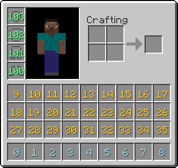

=========
Inventory
=========

Each item in a player's inventory has an ID associated with it. The follow image displays the ID's of every slot. The lime colored numbers represent the armor slots of a player and should not be used. Instead, armor slots should be identified with either ``helmet``, ``chestplate``, ``leggings`` or ``boots``.

Item Names
==========

A list of item names can be found at (link to be determined for SpongeAPI). It's recommended to use spaces rather than underscores for readability.